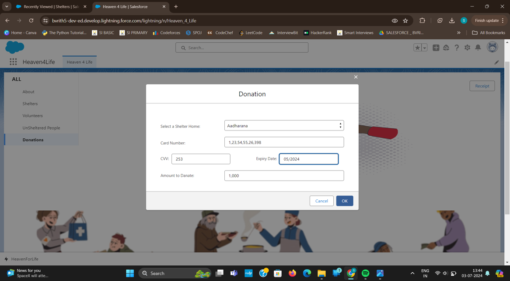

# Homelessness Assistance System using Salesforce

## Project Overview
This project aims to develop a comprehensive solution for homelessness assistance using Salesforce. By leveraging various Salesforce technologies like Salesforce CRM, Service Cloud, Community Cloud, Analytics, and Nonprofit Cloud, this system centralizes client and organization data, streamlines case management, and enhances service delivery.

The system addresses the challenges faced by traditional methods of homelessness assistance by improving coordination, tracking outcomes, and providing a better experience for both clients and service providers.

## Technologies Used
Salesforce CRM: Centralizes client and organization data.
Service Cloud: Unifies case management and provides a knowledge base for caseworkers.
Community Cloud: Offers a self-service portal for clients and partners.
Analytics: Provides insights through data analysis for better decision-making.
Nonprofit Cloud: Tailored for nonprofit operations, including program management and volunteer tracking

## Key Features
Client Data Management: Securely stores client information and tracks their progress in the system.
Case Management: Caseworkers can manage cases, track outcomes, and provide timely support.
Self-Service Portal: Clients and partners can access information and resources independently.
Data Analysis: Dashboards and reports to analyze the effectiveness of programs and services.
Program and Volunteer Tracking: Manages nonprofit operations, including volunteer participation and program metrics.

Screenshots:

